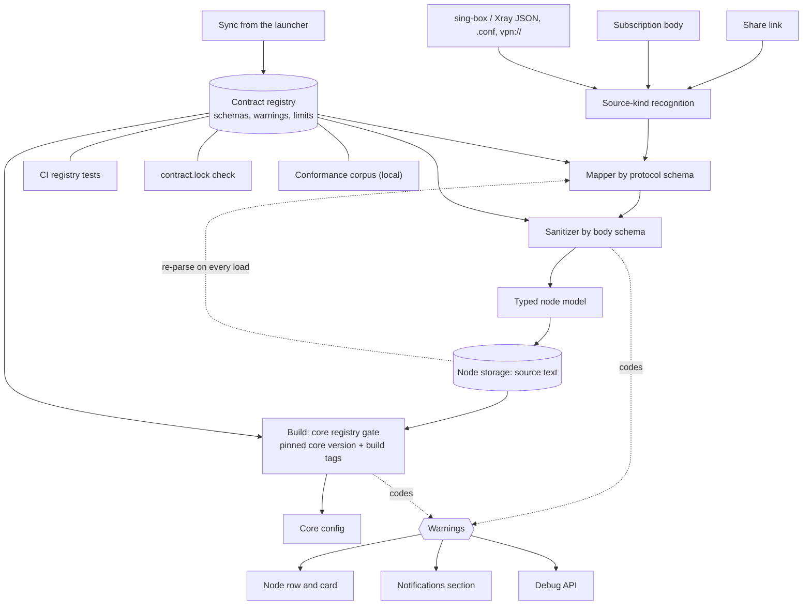

[English](FEATURE.md) · [Русский](FEATURE.ru.md)

# Contract registry — protocol schemas, node sanitizing and warning codes

LxBox checks every VPN node — from a VLESS or Hysteria2 share link to a WireGuard, AmneziaWG or
Tailscale body — against a contract registry it shares with the desktop launcher: protocol schemas,
field rules, warning codes and limits. The registry judges a node twice, at import and at config
build for the pinned sing-box-lx core, and every field it removes or replaces is named by a code
with a text, a reason and a "Learn more" page. The registry arrives by sync only; CI tests, a lock
file and a conformance corpus keep the copy honest.

| Field | Value |
|------|----------|
| Feature | 025-CONTRACT_REGISTRY |
| Type | Mechanism feature (shared with the launcher; executed by import, build and the node card) |
| Absorbed | `§460F` `§472F` `§480F` (registry parts of `§002` and `§021`) |
| Contract | registry `1.1.99`, copy hash `388251fc…`, synced 2026-09-27; core in `body.core` — `1.14.1-lx.4`, `1.14.2-lx.6` |
| State | ✅ written from code, 2026-09-29 |

## Purpose

The launcher and the app parse the same subscriptions. Two hand-written parsers would diverge on
the first odd link and give the user a different node set on the phone and on the desktop. The
registry is the one place where the rules live: which link schemes exist, which fields a body may
carry, which values the core accepts, what a warning says. The app executes the registry; it keeps
no copy of the rules in code.

Principles the feature protects:

- **Rules are data.** A new scheme, field or code arrives with a sync, not with a code change.
- **The sanitizer is the only judge of values.** Mappers translate, the model stores.
- **A loss is named, and named the same in both apps.** Every removed field, replaced value or
  dropped entry carries a registry code; the text, the reason and the fix come from the registry.
- **The core is judged at build, not at parse.** A node does not depend on which core is running;
  build tags and `min_core` are judged once, against the pinned core.
- **The copy is never edited by hand.** Copies and mirrors arrive by sync; a guard catches an edit.

## Promises

- **P1. Every input goes through mapper → sanitizer → model by the registry.** Link, `.conf`,
  Xray and sing-box objects share one path and one set of value rules. **Witness:** unit tests
  "an unknown key is removed with `unknown_key`", "enum outside the set → `on_invalid` with the
  registry code", "the vless schema expands tls / transports / dialer". **Mutation:** a value rule
  written in a mapper.
- **P2. A node the core would reject is removed at parse time.** A rule with the "remove node"
  verdict (severity `error`) drops the entry and puts the code into the rejects. **Witness:** unit
  tests "a method outside the core set removes the node entirely", "URI `headerType=http` → no
  node, code `transport_header_unsupported`". **Mutation:** `drop_node` turned into a warning on a
  live node.
- **P3. Parsing does not depend on the running core.** `min_core` and platform gates are off at
  parse time. **Witness:** unit tests "core gates at parse time are off: `min_core` yields no
  code", "core gates are off on the verbatim map too". **Mutation:** parsing passes the real core
  version to the sanitizer.
- **P4. Warnings survive a restart.** A node is stored as source text and re-parsed on every load;
  codes are recomputed, not serialized. **Witness:** unit test "warnings survive storage: the node
  is re-parsed". **Mutation:** codes read from storage.
- **P5. Secrets do not leak into reasons.** The value of a field marked `secret` is `***` in the
  text, in the rejects and in the log. **Witness:** unit tests "a broken secret uuid leaks neither
  into the text nor into the log", "secret: the value in the warning is masked". **Mutation:**
  masking in the text only, not in `value`.
- **P6. Every registry field survives the body → model → body round trip.** Fields the model does
  not hold return from the cleaned map. **Witness:** unit tests "every field of the schema lands in
  at least one body", "a body field survives the round trip body → model → emit", per scheme.
  **Mutation:** the model silently drops a field it does not know.
- **P7. A missing registry does not break the app.** Load failure is logged, the app starts, the
  build gate is a no-op, the sanitizer returns a body as is. **Witness:** unit tests "registry not
  loaded — the gate is a no-op", "registry not loaded — the body is returned as is".
  **Mutation:** a load error aborts startup.
- **P8. A node the pinned core cannot run stays out of the config.** A protocol, field or range
  form with `on_core_unsupported: drop_node` whose `build_tag` or `min_core` the core lacks is
  removed whole with a registry code; an unknown version or unknown tag set is not a refusal.
  **Witness:** unit tests "tailscale: without the tag — refusal with a code; with the tag and
  without knowledge of tags — accepted", "AWG range form: a range on an old core removes the node,
  a number does not", "AWG 3.x field: `min_core` unmet — node removed; version unknown — kept".
  **Mutation:** an unknown core version treated as too old.
- **P9. The build gate cleans bodies by the schema, and an entry without `type` never reaches the
  core.** **Witness:** unit tests "naive from a JSON source: `foo` and `tls.insecure` removed,
  `certificate` intact", "an entry without a required field is removed whole", "a body of a
  foreign dialect is removed with a warning on the node", "empty and non-string `type` is removed
  too". **Mutation:** the `type` check placed after the registry-loaded check.
- **P10. An authored body is only commented on.** A soft rule leaves the value and gives a code
  with `applied: false`; a hard rule (`core_rejects`, `type`, the core gate) is applied.
  **Witness:** unit tests "soft violation: body unchanged, code with `applied: false`", "hard
  violation is fixed: `flow` outside the core set removed", "an invalid `encryption` removes the
  authored node too". **Mutation:** a soft rule edits an authored body.
- **P11. Codes reach the user in three places.** The node row and the notifications sheet, the
  Notifications section of the node screen, and the Debug API with pinned English texts.
  **Witness:** widget tests "a tap on the row → a sheet with all notifications", "the row shows the
  registry code TITLE, not the full text"; unit tests "registry code: code, path, value and both
  texts", "3 nodes with one raw tag → 3 keys, all warnings in place". **Mutation:** the Debug API
  text depends on the device locale.
- **P12. Levels are shown separately.** `error` lives in the rejects, `warning` and `info` on the
  node; the row shows the top level, info-only is an icon. **Witness:** widget tests "only info —
  no warning row at all", "error + warning — red text of the top one, no info icon", "`+N more`
  counts only error and warning", "counters by level, no zeros". **Mutation:** info counted in
  `+N more`.
- **P13. Every registry code has full texts and a "Learn more" anchor.** `en` and `ru` titles and
  texts are filled; the documentation mirror has an anchor per code and names the shipped
  version. **Witness:** unit tests "every code has all texts filled in en and ru", "every registry
  code has an anchor in `warnings.md`", "the version in the mirror README equals the shipped
  VERSION". **Mutation:** a code with an empty `title_ru` passes.
- **P14. An unknown code is shown, not hidden.** A code missing from the registry is rendered as
  the code itself with severity `warning`; an unfilled placeholder stays visible. `no witness` —
  the fallback is in code, no test names it.
- **P15. The copy, the mirror and the lock agree.** The vendored copy hashes to `contract.lock`,
  the app mirror equals the copy file by file, the documentation mirror equals the generated
  pages. **Witness:** CI step "Contract lock" (manual check: edit any file under `app/contract/`,
  the check exits with the diff); unit test "the assets mirror matches the contract copy".
  **Mutation:** the tree hash includes file names.
- **P16. Registry tests run on CI and are not skipped; a corpus skip is loud.** Registry tests
  load the committed mirror; corpus suites without the copy print their list. **Witness:** unit
  test "corpus skip guard — summary of skips" (asserts the mirror exists); CI log
  "corpus skipped suites (N)". **Mutation:** a registry test gated on the vendored copy.
- **P17. A protocol arriving by sync loads without a code change.** The protocol set is read from
  the bundle manifest, not from a list in code. **Witness:** unit tests "every file of
  `protocols/` is read — composition from the directory", "load() takes the `protocols/`
  composition from the manifest", "contract 1.1.48/49 — `amneziawg` in the set WITHOUT a code
  change". **Mutation:** a hard-coded protocol list.
- **P18. Registry references into the app do not go stale silently.** Every `refs.dart` points to
  an existing file or to an allowlist that cleans itself. **Witness:** unit test "`refs.dart`
  point to existing files or to the allowlist". **Mutation:** an allowlist entry for a file that
  exists again still passes.
- **P19. Dictionaries in code equal the registry.** uTLS fingerprints, backup codes (both
  directions) and limits match. **Witness:** unit tests "utls_fingerprints", "backup_warnings ↔
  app codes", "registry limits equal the code constants". **Mutation:** a one-way check.

## Controlled parameters

No user settings. The knobs are the registry and the pins it is judged against.

| Parameter | Value | Source |
|----------|----------|----------|
| Contract version | `1.1.99` | `app/contract.lock` (`source_sha`, `sha256`), `app/assets/contract/VERSION` |
| Core the build gate judges against | pinned core `v1.14.2-lx.8` + build-tag mirror | core pin — [021-CORE_CONTRACT](../021-CORE_CONTRACT/FEATURE.md) |
| Empty core version at build | fail-open: `min_core` gates do not fire | build inputs |
| Registry languages | `en`, `ru`; other locales get `en` | `warnings.json` |
| Link length | ≤ 65536, `vpn://` ≤ 524288 | `limits.json` |
| Amnezia decompression | ≤ 4 MiB | `limits.json` |
| Nodes per subscription | 3000 declared; not enforced by the app | `limits.json` (see Maintenance) |
| "Learn more" link | the documentation mirror in this repository, branch `main`, anchor = code | mirror `docs/contract/` |

Registry composition shipped in the build: `VERSION`; `registry/` — `allowlists`, `backup_warnings`,
`containers`, `dialer`, `limits`, `multiplex`, `presets`, `source_kinds`, `tls`, `transports`,
`vars`, `warnings`; `registry/protocols/` — one file per scheme.

| Scheme | Core `type` | Kind | Accepted from |
|---|---|---|---|
| `anytls` | `anytls` | outbound | link, sing-box JSON |
| `chain` | `chain` | outbound | build only (chains) |
| `group` | `selector` / `urltest` | group | sing-box JSON, Xray JSON, link |
| `http` | `http` | outbound | link, sing-box JSON, Xray JSON |
| `hysteria` | `hysteria` | outbound | launcher only — the app builds no v1 node |
| `hysteria2` | `hysteria2` | outbound | link, sing-box JSON, Xray JSON |
| `masque` | `masque` | outbound | link, sing-box JSON |
| `naive` | `naive` | outbound | link, sing-box JSON |
| `openvpn-client` | `openvpn-client` | endpoint | sing-box JSON |
| `shadowsocks` | `shadowsocks` | outbound | link, sing-box JSON, Xray JSON |
| `socks` | `socks` | outbound | link, sing-box JSON, Xray JSON |
| `ssh` | `ssh` | outbound | link, sing-box JSON |
| `tailscale` | `tailscale` | endpoint | sing-box JSON; build tag `with_tailscale` |
| `trojan` | `trojan` | outbound | link, sing-box JSON, Xray JSON |
| `tuic` | `tuic` | outbound | link, sing-box JSON |
| `vless` | `vless` | outbound | link, sing-box JSON, Xray JSON |
| `vmess` | `vmess` | outbound | link, sing-box JSON, Xray JSON |
| `wireguard` | `wireguard` | endpoint | link, sing-box JSON, WireGuard / AmneziaWG `.conf`, `vpn://`, Xray JSON |

Shared sub-schemas: `tls` (TLS, uTLS, REALITY, ECH), `transports` (by `transport.type`),
`multiplex`, `dialer`. Warning dictionary: 108 registry codes (24 `error`, 54 `warning`, 30 `info`)
plus 1 app-only code (`unknown_node_type`); the former app-only `duplicate` is replaced by the
dictionary code `duplicates_collapsed` (contract 1.1.102, task 589).

## Inputs / Outputs

**Inputs:** an entry of one kind (a link line, INI, a JSON object) with its mapper name and source
kind; at build — the emitted node bodies, the core version and its build tags; the registry files
from the app bundle.

**Outputs:** a node with a body in core form, a model and codes `{code, path, value, params}`; the
reject list `dropped[]` with a code and an owner; at build — cleaned bodies, the list of removed
entries and warnings by final config tag; for the user — the row, the card and the Debug API form.

## Data flow

The same flow in text:

1. Input — a link, a subscription body or a JSON/`.conf`/`vpn://` document — is classified into one
   source kind by the registry.
2. The mapper of that kind builds a raw map in core form from the protocol schema; it checks nothing.
3. The sanitizer runs the body schema: type, enum, format, `requires`, `conflicts`, `secret`.
   Every removal or replacement becomes a code; a `drop_node` verdict sends the entry to the rejects.
4. The typed model is built from the cleaned map; the node is stored as its source text and
   re-parsed on every load, so codes are recomputed.
5. At build, the core registry gate judges each body against the pinned core version and build tags:
   what the core cannot run is removed; an authored body is only commented on.
6. The core config is written; codes go to the node row and card, the Notifications section and the
   Debug API.
7. The registry itself arrives by sync from the launcher; CI registry tests, the lock check and the
   local corpus guard the copy.

## Rules and guarantees

- The registry is the only source of schemes, fields, texts and limits; there is no fallback to
  hand-written rules. The one fallback number is the AmneziaWG MTU ceiling.
- Stage order is fixed: mapper → raw map → sanitizer → model → second sanitizer pass over the final
  body → rejects by verdict → dedup within the body ([002-NODE_IMPORT · P8](../002-NODE_IMPORT/FEATURE.md#promises)).
- Rule verdicts: remove the node (`drop_node`, `error`), remove the field with a code, replace the
  value with a code, keep it with an info code.
- Core gates (`build_tag`, `min_core`, platform) are judged only at build, only against the pinned
  core; an unknown version or an unknown tag set never removes a node.
- One `(code, path)` pair — one entry; on a match between the verbatim pass and the final pass the
  verbatim one stays.
- The reject code is the first `error` in body field order; none — `type_invalid` with the tag.
- Codes are recomputed on every load and never written to storage or backup.
- The copy, the app mirror and the documentation mirror are written by the sync script only; the
  tree hash is over file contents in byte order of paths.

## Boundaries

- Parsing of link parameters, body forms, Xray/sing-box JSON walks and `.conf` — [002-NODE_IMPORT](../002-NODE_IMPORT/FEATURE.md).
- Build stages around the gate (detour resolution, folds, chains, healing) — [003-CONFIG_BUILD](../003-CONFIG_BUILD/FEATURE.md).
- The core pin, `lx.*` keys, the core acceptance ritual and feedback to the core — [021-CORE_CONTRACT](../021-CORE_CONTRACT/FEATURE.md).
- Core rejections after start and auto-disabling — [009-NODE_HEALTH](../009-NODE_HEALTH/FEATURE.md).
- Backup warning codes are a separate dictionary (`backup_warnings.json`) — [017-BACKUP_AND_STORAGE](../017-BACKUP_AND_STORAGE/FEATURE.md).
- The registry does not decide node identity (tag), dedup across sources, or network checks.
- The dictionary is shared with the launcher, so a code is not required to have
  a producer in this app: `amnezia_container_choice` and `max_nodes_exceeded` are
  dictionary codes LxBox never emits (the launcher's import path does; the
  `max_nodes_per_subscription = 3000` limit is not enforced here — audit
  [591](../../tasks/591-spec-kit-revision-audit.md), owner's item). The one code
  outside the dictionary is `unknown_node_type`: an app-own code by design
  (`kWarningCodes`, its text lives in the app), see
  [parse-warnings](FUNCTIONS/parse-warnings.md).

## Functions

| Function | What it does | Promises | File |
|---------|-----------|----------|------|
| Registry-driven parse pipeline | Runs every input through mapper, sanitizer and model by the contract registry and keeps node identity stable. | P1 P2 P3 P4 P6 P7 P17 | [registry-pipeline.md](FUNCTIONS/registry-pipeline.md) |
| Parse warnings | Attaches reason codes with registry texts to nodes and to the reject list; secrets are masked. | P2 P4 P5 P14 | [parse-warnings.md](FUNCTIONS/parse-warnings.md) |
| Registry gate at build | Checks every node body against the schema for the pinned core version and build tags; removes what the core cannot run, comments on authored JSON. | P7 P8 P9 P10 P11 | [registry-gate.md](FUNCTIONS/registry-gate.md) |
| Warning codes | The shared code dictionary: levels, where codes are shown, code stability and the "Learn more" page. | P11 P12 P13 P14 | [warning-codes.md](FUNCTIONS/warning-codes.md) |
| Registry sync and guards | The registry as a delivery: contract version, lock, sync script, the two mirrors and the guards that keep them honest. | P15 P16 P17 P18 P19 | [registry-sync-and-guards.md](FUNCTIONS/registry-sync-and-guards.md) |

## Related features

- [002-NODE_IMPORT](../002-NODE_IMPORT/FEATURE.md) — supplies entries to the pipeline and owns
  link, body and JSON parsing; dedup within a body is [002-NODE_IMPORT · P8](../002-NODE_IMPORT/FEATURE.md#promises).
- [003-CONFIG_BUILD](../003-CONFIG_BUILD/FEATURE.md) — runs the registry gate as build stage 5.
- [007-NODE_LIST](../007-NODE_LIST/FEATURE.md) — shows codes on the node row and opens the card.
- [009-NODE_HEALTH](../009-NODE_HEALTH/FEATURE.md) — core rejections carry registry codes too.
- [027-DEBUG_API](../027-DEBUG_API/FEATURE.md) — the Debug API that returns codes with pinned texts.
- [017-BACKUP_AND_STORAGE](../017-BACKUP_AND_STORAGE/FEATURE.md) — the node storage form the
  pipeline re-parses; backup codes are a separate dictionary.
- [021-CORE_CONTRACT](../021-CORE_CONTRACT/FEATURE.md) — the core pin the build gate judges against.
- [023-BUILD_CI_RELEASE](../023-BUILD_CI_RELEASE/FEATURE.md) — the CI jobs the guards run in.

## Maintenance notes

- **The dictionary mirror is byte for byte.** `docs/contract/warnings.md` is copied from the
  launcher's generated pages; a hand edit is caught by the lock check and lost on the next sync.
- **App-own codes stay outside the dictionary.** `unknown_node_type` is the only
  one (`kWarningCodes`, `node_warning.dart`); a new app-own code needs the same
  explicit decision, not a silent addition — the launcher will never render it.
- **`max_nodes_exceeded` has no producer here.** The limit `max_nodes_per_subscription = 3000`
  is declared by the dictionary; whether LxBox enforces it is an open owner's item (audit 591).
- **The corpus does not run on CI.** Red corpus cases are visible locally only
  ([529](../../tasks/529-contract-corpus-local-reds-triage.md)); green registry tests on CI do not
  cancel that.
- **The build-tag mirror is a hand copy.** The gate judges `build_tag` by the app's tag set; a
  guard pins only its version to the core pin, not the set itself.
