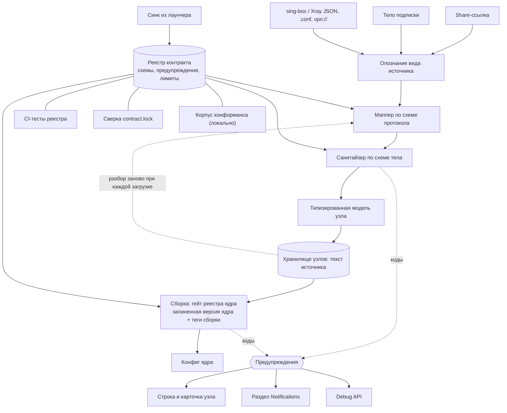

[English](FEATURE.md) · [Русский](FEATURE.ru.md)

# Реестр контракта — схемы протоколов, санитайзинг узлов и коды предупреждений

LxBox проверяет каждый VPN-узел — от share-ссылки VLESS или Hysteria2 до тела WireGuard, AmneziaWG
или Tailscale — по реестру контракта, общему с десктопным лаунчером: схемы протоколов, правила
полей, коды предупреждений и лимиты. Реестр судит узел дважды — при импорте и при сборке конфига
под запиненное ядро sing-box-lx, — и каждое снятое или заменённое поле называется кодом с текстом,
причиной и страницей «Learn more». Реестр приезжает только синком; CI-тесты, lock-файл и корпус
конформанса держат копию честной.

| Поле | Значение |
|------|----------|
| Фича | 025-CONTRACT_REGISTRY |
| Тип | Механизмная фича (общая с лаунчером; исполняется импортом, сборкой и карточкой узла) |
| Поглотила | `§460F` `§472F` `§480F` (реестровые части `§002` и `§021`) |
| Контракт | реестр `1.1.99`, хеш копии `388251fc…`, синк 2026-09-27; ядро в `body.core` — `1.14.1-lx.4`, `1.14.2-lx.6` |
| Состояние | ✅ написана по коду, 2026-09-29 |

## Назначение

Лаунчер и приложение разбирают одни и те же подписки. Два рукописных разборщика разошлись бы на
первой же странной ссылке и дали бы пользователю разный набор узлов на телефоне и на десктопе.
Реестр — единственное место, где живут правила: какие схемы ссылок есть, какие поля может нести
тело, какие значения примет ядро, что говорит предупреждение. Приложение исполняет реестр и не
держит копии правил в коде.

Защищаемые принципы:

- **Правила — данные.** Новая схема, поле или код приезжают синком, а не правкой кода.
- **Санитайзер — единственный судья значений.** Мапперы переводят, модель хранит.
- **Потеря названа, и названа одинаково в обоих приложениях.** Каждое снятое поле, заменённое
  значение или отброшенная запись несёт код реестра; текст, причина и способ исправления — из реестра.
- **Ядро судится на сборке, не при разборе.** Узел не зависит от того, какое ядро запущено; теги
  сборки и `min_core` судятся один раз, против запиненного ядра.
- **Копия руками не правится.** Копии и зеркала приезжают синком; правку ловит страж.

## Обещания

- **P1. Любой ввод проходит маппер → санитайзер → модель по реестру.** Ссылка, `.conf`, объекты
  Xray и sing-box идут одним путём с одними правилами значений. Свидетель: юниты «неизвестный ключ
  снимается с `unknown_key`», «enum вне набора → `on_invalid` с кодом реестра», «схема vless
  раскрывает tls / transports / dialer». Мутация: правило значения, написанное в маппере.
- **P2. Узел, который ядро отвергнет, снимается при разборе.** Правило с вердиктом «снять узел»
  (severity `error`) убирает запись и кладёт код в отбраковку. Свидетель: юниты «метод вне набора
  ядра снимает узел целиком», «URI `headerType=http` → узла нет, код
  `transport_header_unsupported`». Мутация: `drop_node` превращён в предупреждение на живом узле.
- **P3. Разбор не зависит от запущенного ядра.** Гейты `min_core` и платформы при разборе
  выключены. Свидетель: юниты «гейты ядра при разборе выключены: `min_core` кода не даёт», «гейты
  ядра выключены и на дословной карте». Мутация: разбор передаёт санитайзеру реальную версию ядра.
- **P4. Предупреждения переживают перезапуск.** Узел хранится текстом источника и разбирается
  заново при каждой загрузке; коды пересчитываются, не сериализуются. Свидетель: юнит
  «предупреждения переживают хранение: узел разбирается заново». Мутация: коды читаются из хранения.
- **P5. Секреты не утекают в причины.** Значение поля с признаком `secret` — `***` в тексте, в
  отбраковке и в журнале. Свидетель: юниты «битый secret uuid не утекает ни в текст, ни в AppLog»,
  «secret: значение в предупреждении маскируется». Мутация: маскировка только в тексте, не в `value`.
- **P6. Каждое поле реестра переживает круг «тело → модель → тело».** Поля, которых модель не
  держит, возвращаются из очищенной карты. Свидетель: юниты «каждое поле схемы попадает хотя бы в
  одно тело», «поле тела переживает круг „тело → модель → emit“», по схемам. Мутация: модель
  молча теряет незнакомое поле.
- **P7. Отсутствие реестра не ломает приложение.** Сбой загрузки пишется в журнал, приложение
  стартует, гейт сборки — no-op, санитайзер возвращает тело как есть. Свидетель: юниты «реестр не
  загружен — гард no-op», «реестр не загружен — тело возвращается как есть». Мутация: ошибка
  загрузки прерывает старт.
- **P8. Узел, который запиненное ядро не потянет, в конфиг не попадает.** Протокол, поле или
  форма-диапазон с `on_core_unsupported: drop_node`, чьих `build_tag` или `min_core` у ядра нет,
  снимается целиком с кодом реестра; неизвестная версия или неизвестный набор тегов — не отказ.
  Свидетель: юниты «tailscale: без тега — отказ с кодом, с тегом и без знания тегов — годен»,
  «AWG range_form: диапазон на старом ядре снимает узел, число — нет», «AWG 3.x поле: `min_core`
  не выполнен — узел снят; версия неизвестна — нет». Мутация: неизвестная версия ядра считается
  слишком старой.
- **P9. Гейт сборки чистит тела по схеме, а запись без `type` до ядра не доходит.** Свидетель:
  юниты «naive из JSON-источника: `foo` и `tls.insecure` сняты, `certificate` цел», «запись без
  обязательного поля снимается целиком», «тело чужого диалекта снимается с предупреждением на
  узле», «пустой и нестроковый `type` — тоже снимается». Мутация: проверка `type` стоит после
  проверки загрузки реестра.
- **P10. Авторское тело только комментируется.** Мягкое правило оставляет значение и даёт код с
  `applied: false`; жёсткое (`core_rejects`, `type`, гейт ядра) применяется. Свидетель: юниты
  «мягкое нарушение: тело без изменений, код с `applied: false`», «жёсткое нарушение правится:
  `flow` вне набора ядра снят», «негодный `encryption` снимает и авторский узел». Мутация: мягкое
  правило правит авторское тело.
- **P11. Коды доходят до пользователя в трёх местах.** Строка узла и шторка уведомлений, раздел
  Notifications на экране узла, Debug API с пиненными английскими текстами. Свидетель:
  виджет-тесты «тап по строке → шторка со всеми уведомлениями», «текстом идёт ЗАГОЛОВОК кода
  реестра, а не полный текст»; юниты «код реестра: code, path, value и оба текста», «3 узла с
  одним сырым тегом → 3 ключа, все предупреждения на месте». Мутация: текст Debug API зависит от
  локали устройства.
- **P12. Уровни показываются раздельно.** `error` живёт в отбраковке, `warning` и `info` — на
  узле; строка показывает старший уровень, только info — значок. Свидетель: виджет-тесты «только
  info — строки предупреждения нет вовсе», «error + warning — красный текст старшего, info-значка
  нет», «„+N more“ считает только error и warning», «счётчики по уровням, нулевых нет». Мутация:
  info считается в «+N more».
- **P13. У каждого кода реестра полные тексты и якорь «Learn more».** Заголовки и тексты `en` и
  `ru` заполнены; в зеркале документации у каждого кода есть якорь, и оно называет отгруженную
  версию. Свидетель: юниты «у каждого кода все тексты заполнены на en и ru», «у каждого кода
  реестра есть якорь в `warnings.md`», «версия в README зеркала равна отгруженной VERSION».
  Мутация: код с пустым `title_ru` проходит.
- **P14. Незнакомый код показывается, а не глушится.** Код, которого нет в реестре, рисуется самим
  кодом с severity `warning`; незаполненный плейсхолдер остаётся виден. `без свидетеля` — фолбэк
  есть в коде, тест его не называет.
- **P15. Копия, зеркало и lock согласны.** Вендорная копия хешируется в `contract.lock`, зеркало в
  приложении совпадает с копией файл в файл, зеркало документации — со сгенерированными
  страницами. Свидетель: CI-шаг «Contract lock» (ручная проверка: править любой файл в
  `app/contract/` — проверка выходит с диффом); юнит «зеркало assets совпадает с копией контракта».
  Мутация: в хеш дерева входят имена файлов.
- **P16. Реестровые тесты идут на CI и не скипаются; пропуск корпуса громкий.** Реестровые тесты
  грузят закоммиченное зеркало; корпусные сьюты без копии печатают свой список. Свидетель: юнит
  «corpus skip guard — сводка пропусков» (утверждает, что зеркало есть); строка CI-лога
  «corpus skipped suites (N)». Мутация: реестровый тест загейчен на вендорную копию.
- **P17. Протокол, приехавший синком, грузится без правки кода.** Состав протоколов читается из
  манифеста бандла, а не из списка в коде. Свидетель: юниты «каждый файл `protocols/` прочитан —
  состав из каталога», «load() берёт состав `protocols/` из манифеста», «контракт 1.1.48/49 —
  `amneziawg` в наборе БЕЗ правки кода». Мутация: список протоколов в коде.
- **P18. Ссылки реестра в приложение не протухают молча.** Каждая `refs.dart` указывает на
  существующий файл или в самоочищающийся allowlist. Свидетель: юнит «refs.dart указывают на
  существующие файлы или в allowlist». Мутация: запись allowlist на снова существующий файл проходит.
- **P19. Словари в коде равны реестру.** Отпечатки uTLS, коды бэкапа (в обе стороны) и лимиты
  совпадают. Свидетель: юниты «utls_fingerprints», «backup_warnings ↔ коды приложения», «лимиты
  реестра совпадают с константами кода». Мутация: односторонняя сверка.

## Контролируемые параметры

Пользовательских настроек нет. Ручки — сам реестр и пины, против которых он судит.

| Параметр | Значение | Источник |
|----------|----------|----------|
| Версия контракта | `1.1.99` | `app/contract.lock` (`source_sha`, `sha256`), `app/assets/contract/VERSION` |
| Ядро, против которого судит гейт сборки | пин ядра `v1.14.2-lx.8` + зеркало тегов сборки | пин ядра — [021-CORE_CONTRACT](../021-CORE_CONTRACT/FEATURE.ru.md) |
| Пустая версия ядра на сборке | fail-open: гейты `min_core` не срабатывают | входы сборки |
| Языки реестра | `en`, `ru`; прочие локали получают `en` | `warnings.json` |
| Длина ссылки | ≤ 65536, `vpn://` ≤ 524288 | `limits.json` |
| Распаковка Amnezia | ≤ 4 МиБ | `limits.json` |
| Узлов на подписку | 3000 объявлено; приложением не проверяется | `limits.json` (см. сопровождение) |
| Ссылка «Learn more» | зеркало документации в этом репозитории, ветка `main`, якорь = код | зеркало `docs/contract/` |

Состав реестра в сборке: `VERSION`; `registry/` — `allowlists`, `backup_warnings`, `containers`,
`dialer`, `limits`, `multiplex`, `presets`, `source_kinds`, `tls`, `transports`, `vars`,
`warnings`; `registry/protocols/` — по файлу на схему.

| Схема | `type` ядра | Вид | Откуда принимается |
|---|---|---|---|
| `anytls` | `anytls` | outbound | ссылка, sing-box JSON |
| `chain` | `chain` | outbound | только сборка (цепочки) |
| `group` | `selector` / `urltest` | группа | sing-box JSON, Xray JSON, ссылка |
| `http` | `http` | outbound | ссылка, sing-box JSON, Xray JSON |
| `hysteria` | `hysteria` | outbound | только лаунчер — приложение узла v1 не строит |
| `hysteria2` | `hysteria2` | outbound | ссылка, sing-box JSON, Xray JSON |
| `masque` | `masque` | outbound | ссылка, sing-box JSON |
| `naive` | `naive` | outbound | ссылка, sing-box JSON |
| `openvpn-client` | `openvpn-client` | endpoint | sing-box JSON |
| `shadowsocks` | `shadowsocks` | outbound | ссылка, sing-box JSON, Xray JSON |
| `socks` | `socks` | outbound | ссылка, sing-box JSON, Xray JSON |
| `ssh` | `ssh` | outbound | ссылка, sing-box JSON |
| `tailscale` | `tailscale` | endpoint | sing-box JSON; тег сборки `with_tailscale` |
| `trojan` | `trojan` | outbound | ссылка, sing-box JSON, Xray JSON |
| `tuic` | `tuic` | outbound | ссылка, sing-box JSON |
| `vless` | `vless` | outbound | ссылка, sing-box JSON, Xray JSON |
| `vmess` | `vmess` | outbound | ссылка, sing-box JSON, Xray JSON |
| `wireguard` | `wireguard` | endpoint | ссылка, sing-box JSON, `.conf` WireGuard / AmneziaWG, `vpn://`, Xray JSON |

Общие под-схемы: `tls` (TLS, uTLS, REALITY, ECH), `transports` (по `transport.type`), `multiplex`,
`dialer`. Словарь предупреждений: 108 кодов реестра (24 `error`, 54 `warning`, 30 `info`) плюс
1 код только приложения (`unknown_node_type`); прежний `duplicate` заменён словарным кодом
`duplicates_collapsed` (контракт 1.1.102, задача 589).

## Входы / Выходы

**Входы:** запись одного вида (строка ссылки, INI, JSON-объект) с именем маппера и видом
источника; на сборке — эмитированные тела узлов, версия ядра и теги его сборки; файлы реестра
из бандла приложения.

**Выходы:** узел с телом в форме ядра, моделью и кодами `{code, path, value, params}`; список
отбраковки `dropped[]` с кодом и владельцем; на сборке — очищенные тела, список снятых записей и
предупреждения по финальному тегу конфига; для пользователя — строка, карточка и форма Debug API.

## Data flow

Тот же поток текстом:

1. Ввод — ссылка, тело подписки или документ JSON/`.conf`/`vpn://` — относится реестром ровно к
   одному виду источника.
2. Маппер этого вида собирает по схеме протокола сырую карту в форме ядра; он ничего не проверяет.
3. Санитайзер исполняет схему тела: тип, enum, формат, `requires`, `conflicts`, `secret`. Каждое
   снятие или замена становится кодом; вердикт `drop_node` отправляет запись в отбраковку.
4. Из очищенной карты строится типизированная модель; узел хранится текстом источника и разбирается
   заново при каждой загрузке, поэтому коды пересчитываются.
5. На сборке гейт реестра ядра судит каждое тело против запиненной версии ядра и тегов сборки: что
   ядро не потянет — снимается; авторское тело только комментируется.
6. Пишется конфиг ядра; коды уходят в строку и карточку узла, раздел Notifications и Debug API.
7. Сам реестр приезжает синком из лаунчера; CI-тесты реестра, сверка lock и локальный корпус
   стерегут копию.

## Правила и гарантии

- Реестр — единственный источник схем, полей, текстов и лимитов; отката на рукописные правила
  нет. Единственное запасное число — потолок MTU AmneziaWG.
- Порядок стадий фиксирован: маппер → сырая карта → санитайзер → модель → второй проход
  санитайзера по итоговому телу → отбраковка по вердикту → дедуп внутри тела
  ([002-NODE_IMPORT · P8](../002-NODE_IMPORT/FEATURE.ru.md#обещания)).
- Вердикты правила: снять узел (`drop_node`, `error`), снять поле с кодом, заменить значение с
  кодом, оставить с info-кодом.
- Гейты ядра (`build_tag`, `min_core`, платформа) судятся только на сборке и только против
  запиненного ядра; неизвестная версия или неизвестный набор тегов узел не снимают.
- Одна пара `(code, path)` — одна запись; при совпадении дословного и итогового прохода остаётся
  дословный.
- Код отбраковки — первый `error` по порядку полей тела; нет ни одного — `type_invalid` с тегом.
- Коды пересчитываются при каждой загрузке и не пишутся ни в хранение, ни в бэкап.
- Копию, зеркало приложения и зеркало документации пишет только скрипт синка; хеш дерева
  считается по содержимому файлов в байтовом порядке путей.

## Границы

- Разбор параметров ссылок, форм тела, обходов Xray/sing-box JSON и `.conf` — [002-NODE_IMPORT](../002-NODE_IMPORT/FEATURE.ru.md).
- Стадии сборки вокруг гейта (разрешение detour, свёртки, цепочки, лечения) — [003-CONFIG_BUILD](../003-CONFIG_BUILD/FEATURE.ru.md).
- Пин ядра, ключи `lx.*`, ритуал приёма ядра и обратная связь ядру — [021-CORE_CONTRACT](../021-CORE_CONTRACT/FEATURE.ru.md).
- Отказы ядра после старта и автоотключение — [009-NODE_HEALTH](../009-NODE_HEALTH/FEATURE.ru.md).
- Коды предупреждений бэкапа — отдельный словарь (`backup_warnings.json`) — [017-BACKUP_AND_STORAGE](../017-BACKUP_AND_STORAGE/FEATURE.ru.md).
- Реестр не решает идентичность узла (тег), дедуп между источниками и сетевые проверки.
- Словарь общий с лаунчером, поэтому код не обязан иметь производителя в этом
  приложении: `amnezia_container_choice` и `max_nodes_exceeded` — словарные коды,
  которые LxBox не выдаёт (их выдаёт импорт лаунчера; лимит
  `max_nodes_per_subscription = 3000` здесь не проверяется — аудит
  [591](../../tasks/591-spec-kit-revision-audit.md), пункт владельца). Единственный
  код вне словаря — `unknown_node_type`: собственный код приложения по замыслу
  (`kWarningCodes`, текст живёт в приложении), см.
  [parse-warnings](FUNCTIONS/parse-warnings.ru.md).

## Функции

| Функция | Что делает | Обещания | Файл |
|---------|-----------|----------|------|
| Конвейер разбора по реестру | Проводит любой ввод через маппер, санитайзер и модель по реестру контракта и сохраняет идентичность узла. | P1 P2 P3 P4 P6 P7 P17 | [registry-pipeline.md](FUNCTIONS/registry-pipeline.ru.md) |
| Предупреждения разбора | Вешает коды причин с текстами из реестра на узлы и в список отбраковки; секреты маскируются. | P2 P4 P5 P14 | [parse-warnings.md](FUNCTIONS/parse-warnings.ru.md) |
| Гейт реестра на сборке | Проверяет каждое тело узла по схеме для запиненной версии ядра и тегов сборки; снимает то, что ядро не потянет, авторский JSON комментирует. | P7 P8 P9 P10 P11 | [registry-gate.md](FUNCTIONS/registry-gate.ru.md) |
| Коды предупреждений | Общий словарь кодов: уровни, где коды показываются, стабильность кодов и страница «Learn more». | P11 P12 P13 P14 | [warning-codes.md](FUNCTIONS/warning-codes.ru.md) |
| Синк реестра и стражи | Реестр как поставка: версия контракта, lock, скрипт синка, два зеркала и стражи, которые держат их честными. | P15 P16 P17 P18 P19 | [registry-sync-and-guards.md](FUNCTIONS/registry-sync-and-guards.ru.md) |

## Связанные фичи

- [002-NODE_IMPORT](../002-NODE_IMPORT/FEATURE.ru.md) — подаёт записи в конвейер и владеет
  разбором ссылок, тел и JSON; дедуп внутри тела — [002-NODE_IMPORT · P8](../002-NODE_IMPORT/FEATURE.ru.md#обещания).
- [003-CONFIG_BUILD](../003-CONFIG_BUILD/FEATURE.ru.md) — исполняет гейт реестра стадией 5 сборки.
- [007-NODE_LIST](../007-NODE_LIST/FEATURE.ru.md) — показывает коды на строке узла и открывает карточку.
- [009-NODE_HEALTH](../009-NODE_HEALTH/FEATURE.ru.md) — отказы ядра тоже несут коды реестра.
- [027-DEBUG_API](../027-DEBUG_API/FEATURE.ru.md) — Debug API, который отдаёт коды с пиненными текстами.
- [017-BACKUP_AND_STORAGE](../017-BACKUP_AND_STORAGE/FEATURE.ru.md) — форма хранения узлов, которую
  конвейер разбирает заново; коды бэкапа — отдельный словарь.
- [021-CORE_CONTRACT](../021-CORE_CONTRACT/FEATURE.ru.md) — пин ядра, против которого судит гейт сборки.
- [023-BUILD_CI_RELEASE](../023-BUILD_CI_RELEASE/FEATURE.ru.md) — CI-джобы, в которых идут стражи.

## Особенности сопровождения

- **Зеркало словаря — байт в байт.** `docs/contract/warnings.md` копируется из сгенерированных
  страниц лаунчера; ручную правку ловит сверка lock, и она теряется на следующем синке.
- **Собственные коды приложения живут вне словаря.** Такой один —
  `unknown_node_type` (`kWarningCodes`, `node_warning.dart`); новый собственный код —
  такое же явное решение, а не тихое добавление: лаунчер его никогда не покажет.
- **У `max_nodes_exceeded` здесь нет производителя.** Лимит `max_nodes_per_subscription = 3000`
  объявлен словарём; проверять ли его в LxBox — открытый пункт владельца (аудит 591).
- **Корпус на CI не идёт.** Красные кейсы корпуса видны только локально
  ([529](../../tasks/529-contract-corpus-local-reds-triage.md)); зелёные реестровые тесты на CI
  этого не отменяют.
- **Зеркало тегов сборки — ручная копия.** Гейт судит `build_tag` по набору тегов приложения;
  страж пинит только его версию к пину ядра, а не сам набор.
