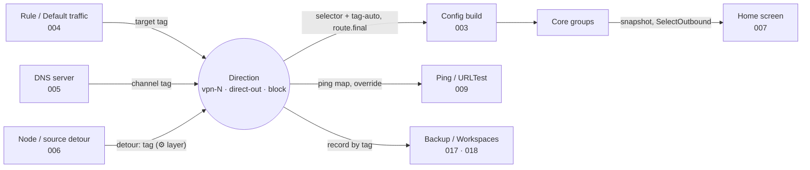

[English](FEATURE.md) · [Русский](FEATURE.ru.md)

# Directions — the routing targets vpn-N, direct-out and block that tie rules, nodes and groups together

A Direction is where LxBox sends traffic: a named exit such as `vpn-1`, `vpn-2` or a custom
`ru-exit`, with its own set of VPN nodes, plus the built-in `direct-out` and `block`. Routing
rules, Default traffic, DNS servers and detour fields point to a Direction by tag; the sing-box
config gets one `selector` group per Direction and an optional `urltest` twin; the home screen
switches the node inside it live.

| Field | Value |
|------|----------|
| Feature | 026-DIRECTIONS |
| Type | Product feature |
| Absorbed | `§125F` (configurable channels), `§248F` (channel as a detour layer), `§393F` (Directions) |
| State | ✅ written from code, 2026-09-29 |

## Purpose

Directions are the one model the rest of the client refers to: a rule names one as its target,
a DNS server as its channel, a node as its detour; the build turns each into a group, the home
screen shows its members, the backup carries it by tag. This feature owns the model; the
neighbours ([004-ROUTING](../004-ROUTING/FEATURE.md), [006-DETOUR_AND_BALANCE](../006-DETOUR_AND_BALANCE/FEATURE.md),
[007-NODE_LIST](../007-NODE_LIST/FEATURE.md)) keep their own angle.

Principles the feature protects:

- **A reference to a Direction is never left dangling.** Deleting or disabling one moves every
  reference to `vpn-1` or resets it, in storage and in memory at once, with one notification.
- **`vpn-1` always exists and is on.** It is the primary Direction, the fallback of every heal
  and the default of Default traffic; a list without it is repaired on load.
- **Identity is the tag, not the name.** The tag is immutable; the title is a client field and
  may carry the `⚙` marker of a detour layer.
- **A Direction without nodes blocks rather than leaks.** An empty membership becomes
  `[block, direct-out]` with `block` as default and a warning.

Out of the box: `vpn-1` ("VPN ①") on with all nodes, `vpn-2` off, Default traffic → `vpn-1`,
no detour layers, no auto twins.

## Promises

- **P1. Rule targets — only live ones:** `direct`, enabled Directions (`vpn-1` always), `block`,
  Reject. Deleting or disabling a Direction moves rules, preset overrides, Default traffic and
  DNS servers that named it to `vpn-1` in storage; re-enabling does not resurrect them.
  **Witness:** units "a disabled Direction is hidden, vpn-1 is always present", "disabling a
  Direction (§202): route_final + rule outbound → vpn-1", "re-enabling does NOT resurrect the old
  reference", "deleting vpn-3 — vars.outbound of a DNS server → vpn-1, like a rule".
  **Mutation:** a dangling target — fatal at start.
- **P2. A Direction tag is immutable and does not conflict:** the first free `vpn-N` without a
  ceiling, or a custom one; forbidden are empty, service tags, a duplicate, a collision with
  `<tag>-auto`. **Witness:** units "the first free one, not max + 1", "config service tags and
  rule pseudo-targets → reserved", "collision with an auto twin in both directions".
  **Mutation:** max + 1 — `vpn-2` vanishes forever after a deletion.
- **P3. `vpn-1` exists and is enabled.** It cannot be disabled or deleted; a loaded list without
  it gets it inserted first. **Witness:** units "import of a list without vpn-1: vpn-1 inserted
  FIRST, the foreign tag intact", "deleteDirection vpn-1 throws", "vpn-1 in place → no-op, the
  file is not rewritten". **Mutation:** a removable `vpn-1` — every heal writes a dangling
  reference and `route.final` is fatal.
- **P4. "Other directions" references are cleaned only on deletion.** Disabling keeps them
  (reversible), the build drops them with a warning; the twin is cleaned with the tag.
  **Witness:** units "delete vpn-2 → include=[vpn-1], counter includes==1", "disable vpn-2 →
  include NOT touched", "the auto twin in include is cleaned with the tag". **Mutation:** clean
  on disable — options vanish after a toggle round-trip.
- **P5. A source prefix change follows into the filters.** Literal occurrences of the old prefix
  in Node filter and Default are rewritten in storage; an occurrence inside a regex construct
  is left with a warning. **Witness:** units "a literal occurrence: the filter is rewritten IN
  STORAGE", "a metachar construct: the filter is NOT touched, a warning is returned", "^RU: →
  ^DE: matches the display tag of the new prefix". **Mutation:** raw substring replace — `R.`
  gets rewritten too.
- **P6. A stored Direction survives a round-trip.** Missing keys get defaults, garbage in
  `include` is dropped on read, an empty `include` is not written. **Witness:** units "full
  direction with auto → JSON → Direction", "defaults applied on missing keys", "reading
  normalizes: trim, no empties, no duplicates, no non-strings", "an empty include does NOT write
  the key". **Mutation:** write `"include": []` — a diff in every user's file.
- **P7. The list is seeded once.** The first run takes `default_directions` from the template; a
  migrated list, even emptied, is never reseeded. **Witness:** units "fresh install: seed from
  the template, enabled_groups empty", "idempotence: a repeated call is a no-op",
  "migrated-and-empty → NOT reseeded". **Mutation:** reseed on every start — deleted Directions
  come back.
- **P8. An empty Direction does not bring down the config:** the filter matched nothing or the
  inversion excluded all → `[block, direct-out]`, default `block`, a warning; a broken regex →
  all nodes. **Witness:** units "regex with no matches → fallback [block, direct-out] default
  block", "invert excludes ALL → fallback", "invalid regex → fallback to all nodes".
  **Mutation:** an empty selector — core fatal.
- **P9. Default traffic to a vanished target → `vpn-1`** with a warning; a twin that was not
  emitted counts as vanished, a live twin is valid. **Witness:** units "route_final to a deleted
  Direction → vpn-1", "route_final = a non-emitted auto twin (0 nodes) → vpn-1 + warning",
  "route_final to its own auto twin is valid". **Mutation:** keep the tag — the core refuses
  the config.
- **P10. Membership order is normative:** `<tag>-auto`, `direct-out`, `block`, "Other
  directions", then nodes in config order; an `include` of a Direction below, disabled or
  missing is dropped with a warning; a disabled Direction is not emitted, `vpn-1` always is.
  **Witness:** contract "the Direction corpus is in sync" (fixtures `include_earlier_direction`,
  `include_direct_and_block`), units "a disabled Direction is not emitted (vpn-1 still
  required)", "includeDirect=true → direct-out as an option". **Mutation:** nodes first — a
  subscription node becomes the implicit default.
- **P11. The auto twin is emitted only with a pool.** The toggle on and at least one non-group
  node; group nodes stay in the selector only; the twin becomes the selector's default unless
  the Default regex matched. **Witness:** units "auto != null → <tag>-auto urltest over the
  Direction's nodes", "empty node-set → the twin is NOT emitted", "§322 — the auto-select node
  is in the selector, not in the twin"; corpus fixtures `auto_twin_emitted_and_default`,
  `auto_twin_default_yields_to_explicit`. **Mutation:** an empty `urltest` — core fatal.
- **P12. The node filter is case-insensitive and invertible.** "Exclude matching" takes the
  nodes that do not match; an empty filter ignores the inversion. **Witness:** units "§301 —
  nodeFilter is case-insensitive", "§197 — nodeFilterInvert: exclude matched", "§197 — invert +
  empty filter → all nodes". **Mutation:** case-sensitive — a lower-case filter loses flags.
- **P13. Default is the first matching member.** No match or a non-member → the key is absent
  and the core takes the first option. **Witness:** units "defaultFilter → the first matched
  node as default", "the first in order among several matches", "no matches → default is not
  set", "default must be in the node-set (not direct-out)". **Mutation:** a default outside the
  members — the core rejects the config.
- **P14. Tolerances are clamped.** `tolerance` to 0–65535, `pool_tolerance` to 0–15000 (the
  core's limit, as for an auto-select node), `pool` to ≥ 1, on read, on save and in the editor.
  **Witness:** units "from JSON above 65535 → clamp", "negative → 0", "pool clamp: 0/negative →
  1", "§604: poolTolerance clamp по пределу ядра 15000, как у узла".
  **Mutation:** pass through — the core crashes on a uint16 overflow.
- **P15. Node selection is applied live.** Choosing another node in a Direction with the tunnel
  up goes to the core as `SelectOutbound`, then the list pulls a fresh group snapshot; the
  tunnel is not restarted. **Witness:** unit "selecting another node goes to the core via a
  select call". **Mutation:** rebuild the config on node selection.
- **P16. The Direction dropdown is the core's selector list.** Every selector group of the
  snapshot except `GLOBAL`, `NETWORKS` last when present; the start position is `route.final`
  if it is a selector, otherwise the first; a vanished Direction falls back the same way.
  **Witness:** units "a real Direction is selected — that Direction's list", "no real
  Directions — one pseudo-direction", "VPN off — NETWORKS is not shown"; the `route.final`
  fallback — `no witness`. **Mutation:** keep the vanished tag — an empty list.
- **P17. Breaking connections on switch — only by the toggle.** With "Interrupt connections on
  switch" on, after a node is selected the live connections of that Direction are closed; by
  default — not. **Witness:** units "switchNode с Interrupt=on закрывает только живые
  соединения переключаемой группы, не трогая другую", "switchNode с Interrupt=off не
  закрывает ничего" — **покрыто 2026-09-30:** `test/controllers/interrupt_on_switch_test.dart`.
  **Mutation:** ignore the toggle — always or never close.
- **P18. A detour Direction is a permission, not a role.** In the detour picker the Directions
  section contains only enabled Directions with "Use as detour"; they also remain a legitimate
  target of rules and `route.final`; `vpn-1` is never a detour Direction, neither via the UI
  nor via a backup. **Witness:** units "ordinary Direction hidden, detour one visible, disabled
  detour hidden", "vpn-1 + detour:true → isDetour coerced to false", "custom rule to a detour
  Direction → config valid", "route_final = detour Direction stays". **Mutation:** subtract
  detour Directions from rule targets.
- **P19. A retired layer leaves no dangling detour references.** Disabling or deleting a
  Direction or clearing "Use as detour" resets references to it and to `<tag>-auto` to "None",
  irreversibly; setting the flag heals nothing. The result is reported in a single
  notification. **Witness:** units "flag-unset: all four kinds of detour references",
  "flag-unset is irreversible", "disable/delete of a detour Direction heals detour references",
  "resync mirrors the storage heal; saving does not resurrect the reference". **Mutation:** heal
  only storage without the in-memory mirror.
- **P20. The ⚙ marker lives in the Direction's name.** The "Use as detour" flag adds `⚙ ` to
  the name, clearing it removes it; the marker cannot be removed by hand and is not doubled on
  repeat. **Witness:** units "copyWith(isDetour:true) renames the label", "user erased ⚙ with
  the box checked → it comes back", "storage roundtrip: label with ⚙ is stable". **Mutation:**
  ⚙ only in the display.
- **P21. The twin's test parameters reach the core as set.** `url`, `interval`, `tolerance`,
  `idle_timeout`, `interrupt_exist_connections` and the global `passive_check`; "Fastest" adds
  neither `mode` nor `balancer`. **Witness:** units "interruptExistConnections=false is passed
  through", "§272 passiveCheck=true → passive_check in the auto twin", "§272 passiveCheck=false
  (default) → no key", "leastTest (default) → NO mode/balancer". **Mutation:** always write
  `passive_check` — an older core rejects the config.

## Controlled parameters

| Setting | Values | Default | Core config key |
|---|---|---|---|
| Tag | `vpn-N` or custom, immutable | first free `vpn-N` | `selector.tag`; references |
| Title | text; carries `⚙ ` for a detour layer | "VPN ⓝ" or the tag | — |
| Enabled | on/off, `vpn-1` locked on | `vpn-1` on, `vpn-2` off | emitted or not |
| Include direct-out / Include block / Other directions | options | off / off / none | head of `outbounds` |
| Node filter (regex) / Exclude matching / Default (regex) | case-insensitive | empty / off / empty | `outbounds`, `default` |
| Interrupt connections on switch | on/off | on | `interrupt_exist_connections` |
| Include auto (urltest): Test URL, Interval, Tolerance, Idle timeout, Interrupt, Mode, Pool size, Pool tolerance, Sticky session by | see [groups](FUNCTIONS/direction-groups-in-config.md) | off | the `<tag>-auto` group |
| Use as detour | on/off, hidden for `vpn-1` | off | — (client role) |
| Default traffic | `direct` · Direction · `block` | `vpn-1` | `route.final` |
| Direction (home screen dropdown) | selector groups of the snapshot, `NETWORKS` | `route.final` | RPC `SelectOutbound` |
| Ping URL / timeout override | per Direction | global | — (009) |

## Inputs / Outputs

**Inputs:** the stored `directions[]` list; the template's `default_directions` on first run;
final node tags of all sources; chain positions; the core's group snapshot; user actions on the
Directions tab, in the editor and on the home screen; Debug API `/directions`; a backup.

**Outputs:** `outbounds[type=selector]` and `outbounds[type=urltest]` per Direction,
`route.final`; build warnings and the "Directions without nodes" snackbar; the target pickers of
rules, presets, DNS and detour; `SelectOutbound` and `CloseConnection` calls; one notification
with the healed counters; the Debug API `healed` body.

## Who sees what

| Viewer | What it sees in a Direction | Owner |
|---|---|---|
| Rule, preset, Default traffic | a target by tag; heals to `vpn-1` when the Direction goes | [004-ROUTING](../004-ROUTING/FEATURE.md) · here P1 |
| DNS server | a channel by tag (`outbound` variable or `detour`); heals to `vpn-1`, fail-closed at build | [005-DNS](../005-DNS/FEATURE.md) · here P1 |
| Config build | a `selector` + `-auto` twin in list order, `route.final` | [003-CONFIG_BUILD](../003-CONFIG_BUILD/FEATURE.md) · here P8–P14 |
| Nodes, home screen | the members of the selector group, the active node, the dropdown | [007-NODE_LIST](../007-NODE_LIST/FEATURE.md) · here P15–P17 |
| Detour of a node or source | an upstream layer with ⚙; references reset when retired | [006-DETOUR_AND_BALANCE](../006-DETOUR_AND_BALANCE/FEATURE.md) · here P18–P20 |
| Ping and URLTest | a per-Direction ping map and override; the twin's schedule | [009-NODE_HEALTH](../009-NODE_HEALTH/FEATURE.md) · here P21 |
| Backup, Workspaces | the record by tag with the detour flag and ping override; part of a slot, the core's selection cache is not | [017-BACKUP_AND_STORAGE](../017-BACKUP_AND_STORAGE/FEATURE.md), [018-WORKSPACES](../018-WORKSPACES/FEATURE.md) |
| Automation, Debug API | switch a node or Direction by tag; CRUD and reorder | [014-AUTOMATION](../014-AUTOMATION/FEATURE.md), [027-DEBUG_API](../027-DEBUG_API/FEATURE.md) |



## Data flow

```
stored list ─► on load: vpn-1 insured (P3), orphan ping overrides pruned, seed once (P7)
      │
      ├─► editor / tab / Debug API ─► one mutation point ─► heal references (P1, P4, P19)
      │                                                     ─► in-memory mirror ─► notification
      ▼
config build: reserve tags ─► filter (P12) ─► minus chains through itself ─► order (P10)
      ─► empty → [block, direct-out] (P8) ─► default (P13) ─► twin (P11, P14, P21)
      ─► route.final (P9) ─► pre-start check
      ▼
core groups ─► home screen dropdown (P16) ─► SelectOutbound (P15) ─► CloseConnection (P17)
```

## Rules and guarantees

- Directions are emitted and scoped in list order: "Other directions" may name only Directions
  above; reordering is a Debug API operation and heals nothing.
- Every heal is one storage write plus the in-memory mirror; a bulk replace of the list (tab,
  reorder) is the only heal-free path, by design.
- The selection inside a selector is not stored by the app; the core's
  `experimental.cache_file` (`cache.db`) restores it on the next start.
- A per-Direction ping override and "Other directions" survive disabling and die with deletion;
  rule, DNS and detour references die with either.

## Boundaries

- Rule conditions, order and actions — [004-ROUTING](../004-ROUTING/FEATURE.md); the DNS side of
  a channel — [005-DNS](../005-DNS/FEATURE.md); node detour, source policy, hop chains, rings and
  balancing modes — [006-DETOUR_AND_BALANCE](../006-DETOUR_AND_BALANCE/FEATURE.md).
- The node list itself (filters, sorting, pinning, badges, folders, folds) —
  [007-NODE_LIST](../007-NODE_LIST/FEATURE.md); `NETWORKS` composition —
  [012-LIVE_STATE](../012-LIVE_STATE/FEATURE.md); measurement —
  [009-NODE_HEALTH](../009-NODE_HEALTH/FEATURE.md); the build pipeline and the pre-start check —
  [003-CONFIG_BUILD](../003-CONFIG_BUILD/FEATURE.md).
- No UI reordering of Directions, and it is not planned (owner decision 2026-09-29, audit [591](../../tasks/591-spec-kit-revision-audit.md)): the
  order changes only through the Debug API (`POST /directions/reorder`). No per-node references
  from a Direction (membership is a regex).
- The former discrepancies (`pool_tolerance` clamp 65535 vs the core's 15000, `interval` `5m` for
  a stored twin without the key, the row's node count ignoring "Exclude matching") are fixed
  in 604.

## Functions

| Function | What it does | Promises | File |
|---|---|---|---|
| Direction model | Defines the named exit, its tag, title, built-ins and options, and heals every reference when a Direction is deleted or disabled. | P1–P7 | [direction-model.md](FUNCTIONS/direction-model.md) |
| Direction groups in the config | Writes each Direction as a `selector` with its `<tag>-auto` twin, membership order, defaults and `route.final`. | P8–P14 | [direction-groups-in-config.md](FUNCTIONS/direction-groups-in-config.md) |
| Direction and active node | Selects a Direction and a node in the running core from the home screen, with `NETWORKS` and swipe-to-refresh. | P15–P17 | [direction-selection.md](FUNCTIONS/direction-selection.md) |
| Direction as a detour layer | Turns a Direction into a switchable upstream for many nodes, marks it with ⚙ and resets detour references when the layer is retired. | P18–P20 | [direction-as-detour.md](FUNCTIONS/direction-as-detour.md) |
| Direction health | Names the ping map, the per-Direction test override and the twin's URLTest schedule that belong to a Direction. | P21 | [direction-health.md](FUNCTIONS/direction-health.md) |

## Related features

- [003-CONFIG_BUILD](../003-CONFIG_BUILD/FEATURE.md) — emits the groups; `route.final` degradation is its P8, dangling targets its P9 fatal.
- [004-ROUTING](../004-ROUTING/FEATURE.md) — rules and Default traffic target a Direction; import heals a dangling one ([004-ROUTING · P19](../004-ROUTING/FEATURE.md#promises)).
- [005-DNS](../005-DNS/FEATURE.md) — a DNS server's channel, fail-closed at build ([005-DNS · P2](../005-DNS/FEATURE.md#promises)).
- [006-DETOUR_AND_BALANCE](../006-DETOUR_AND_BALANCE/FEATURE.md) — the detour picker, chains a Direction subtracts ([006-DETOUR_AND_BALANCE · P9](../006-DETOUR_AND_BALANCE/FEATURE.md#promises)), twin balancing ([006-DETOUR_AND_BALANCE · P13](../006-DETOUR_AND_BALANCE/FEATURE.md#promises)).
- [007-NODE_LIST](../007-NODE_LIST/FEATURE.md) — the node list of the selected Direction, pinning ([007-NODE_LIST · P3](../007-NODE_LIST/FEATURE.md#promises)), filters per Direction.
- [009-NODE_HEALTH](../009-NODE_HEALTH/FEATURE.md) — ping maps and overrides per Direction ([009-NODE_HEALTH · P2, P5](../009-NODE_HEALTH/FEATURE.md#promises)), the twin's reselection.
- [012-LIVE_STATE](../012-LIVE_STATE/FEATURE.md) — the `NETWORKS` pseudo-direction ([012-LIVE_STATE · P19](../012-LIVE_STATE/FEATURE.md#promises)).
- [014-AUTOMATION](../014-AUTOMATION/FEATURE.md) — switching a node or Direction from outside.
- [017-BACKUP_AND_STORAGE](../017-BACKUP_AND_STORAGE/FEATURE.md) — Directions in the backup; node addresses ([017-BACKUP_AND_STORAGE · P17](../017-BACKUP_AND_STORAGE/FEATURE.md#promises)).
- [018-WORKSPACES](../018-WORKSPACES/FEATURE.md) — Directions are part of a slot.
- [027-DEBUG_API](../027-DEBUG_API/FEATURE.md) — `/directions` CRUD, reorder, `healed` counters.

## Maintenance notes

- **Five kinds of references, two lifetimes.** Rules, DNS and detour references die on disable
  and delete; "Other directions", chain positions and ping overrides only on delete. A sixth
  kind joins the same heal and the same notification.
- **The twin tag `<tag>-auto` is derived, never stored;** the hyphen is part of the contract
  with the template's `magic_nodes` and with filters and sorting.
- **The tab's node count is a preview from the running core's snapshot,** not from the build:
  with the tunnel down it can only say "all nodes" or "filtered".
- **`vpn-1` is a product decision hard-coded on purpose:** required, non-detour, the target of
  every heal; every load path passes through the one migration that insures it.
