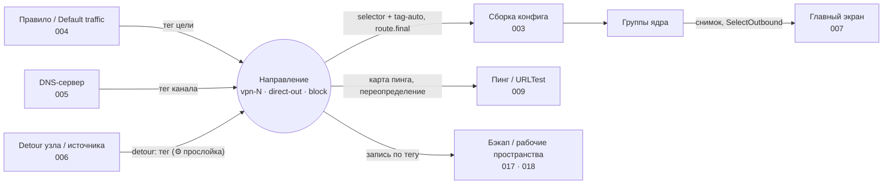

[English](FEATURE.md) · [Русский](FEATURE.ru.md)

# Направления — адресаты маршрутизации vpn-N, direct-out и block, связывающие правила, узлы и группы

Направление — то, куда LxBox отправляет трафик: именованный выход вроде `vpn-1`, `vpn-2` или
своего `ru-exit` со своим набором VPN-узлов, плюс встроенные `direct-out` и `block`. Правила
маршрутизации, Default traffic, DNS-серверы и поля detour указывают на Направление по тегу;
конфиг sing-box получает по группе `selector` на каждое Направление и необязательный двойник
`urltest`; главный экран переключает узел внутри него вживую.

| Поле | Значение |
|------|----------|
| Фича | 026-DIRECTIONS |
| Тип | Продуктовая фича |
| Поглотила | `§125F` (настраиваемые каналы), `§248F` (канал как detour-прослойка), `§393F` (Направления) |
| Состояние | ✅ написана по коду, 2026-09-29 |

## Назначение

Направления — та единственная модель, на которую ссылается остальной клиент: правило называет
Направление целью, DNS-сервер — каналом, узел — своим detour; сборка превращает каждое в группу,
главный экран показывает его состав, бэкап переносит его по тегу. Эта фича владеет моделью;
соседи ([004-ROUTING](../004-ROUTING/FEATURE.ru.md), [006-DETOUR_AND_BALANCE](../006-DETOUR_AND_BALANCE/FEATURE.ru.md),
[007-NODE_LIST](../007-NODE_LIST/FEATURE.ru.md)) оставляют себе свой ракурс.

Принципы, которые фича защищает:

- **Ссылка на Направление никогда не остаётся висеть.** Удаление или выключение переводит каждую
  ссылку на `vpn-1` или сбрасывает её, в хранении и в памяти разом, с одним уведомлением.
- **`vpn-1` всегда существует и включено.** Это главное Направление, запас каждого лечения и
  умолчание Default traffic; список без него чинится при загрузке.
- **Идентичность — тег, а не имя.** Тег неизменяем; название — поле клиента и может нести маркер
  `⚙` detour-прослойки.
- **Направление без узлов блокирует, а не пропускает.** Пустой состав становится `[block,
  direct-out]` с умолчанием `block` и предупреждением.

Из коробки: `vpn-1` («VPN ①») включено со всеми узлами, `vpn-2` выключено, Default traffic →
`vpn-1`, detour-прослоек и auto-двойников нет.

## Обещания

- **P1. Цели правил — только живые:** `direct`, включённые Направления (`vpn-1` всегда), `block`,
  Reject. Удаление или выключение Направления переводит правила, переопределения пресетов,
  Default traffic и называвшие его DNS-серверы на `vpn-1` в хранении; повторное включение не
  воскрешает. **Свидетель:** юниты «выключенное Направление скрыто, vpn-1 присутствует всегда»,
  «disable Направления (§202): route_final + rule outbound → vpn-1», «повторное включение НЕ
  воскрешает старую ссылку», «удаление vpn-3 — vars.outbound DNS-сервера → vpn-1, как у правила».
  **Мутация:** висячая цель — fatal на старте.
- **P2. Тег Направления неизменяем и не конфликтует:** первый свободный `vpn-N` без потолка или
  свой; запрещены пустой, служебные, дубль, коллизия с `<tag>-auto`. **Свидетель:** юниты
  «первый свободный, а не максимум + 1», «служебные теги конфига и псевдо-цели правил →
  reserved», «коллизия с auto-двойником в обе стороны». **Мутация:** max + 1 — `vpn-2` после
  удаления исчезает навсегда.
- **P3. `vpn-1` существует и включено.** Его нельзя выключить и удалить; загруженный список без
  него получает его первым. **Свидетель:** юниты «импорт списка без vpn-1: vpn-1 вставлен
  ПЕРВЫМ, чужой тег цел», «deleteDirection vpn-1 throws», «vpn-1 на месте → no-op, файл не
  переписан». **Мутация:** удаляемый `vpn-1` — каждое лечение пишет висячую ссылку,
  `route.final` — fatal.
- **P4. Ссылки «Other directions» вычищаются только при удалении.** Выключение их оставляет
  (обратимо), сборка пропускает с предупреждением; двойник вычищается вместе с тегом.
  **Свидетель:** юниты «delete vpn-2 → include=[vpn-1], счётчик includes==1», «disable vpn-2 →
  include НЕ тронут», «auto-двойник в include вычищается вместе с тегом». **Мутация:** чистить
  при выключении — опции пропадают после туда-обратно.
- **P5. Смена префикса источника уходит в фильтры.** Литеральные вхождения старого префикса в
  Node filter и Default переписываются в хранении; вхождение внутри regex-конструкции остаётся
  с предупреждением. **Свидетель:** юниты «литеральное вхождение: фильтр переписан В STORAGE»,
  «metachar-конструкция: фильтр НЕ тронут, предупреждение возвращено», «^RU: → ^DE: матчит
  display-тег нового префикса». **Мутация:** сырая замена подстроки — `R.` тоже переписывается.
- **P6. Сохранённое Направление переживает туда-обратно.** Отсутствующие ключи получают
  умолчания, мусор в `include` отбрасывается при чтении, пустой `include` не пишется.
  **Свидетель:** юниты «full direction with auto → JSON → Direction», «defaults applied on
  missing keys», «чтение нормализует: trim, без пустых, без дублей, без не-строк», «пустой
  include ключа НЕ пишет». **Мутация:** писать `"include": []` — diff в файле каждого
  пользователя.
- **P7. Список сеется один раз.** Первый запуск берёт `default_directions` из шаблона;
  мигрированный список, даже опустошённый, не пересеивается. **Свидетель:** юниты «fresh
  install: seed из template, enabled_groups пуст», «идемпотентность: повторный вызов — no-op»,
  «мигрировано-пусто → НЕ пересеивать». **Мутация:** пересев на каждом старте — удалённые
  Направления возвращаются.
- **P8. Пустое Направление не роняет конфиг:** фильтр ничего не поймал или инверсия исключила
  всё → `[block, direct-out]`, умолчание `block`, предупреждение; битый regex → все узлы.
  **Свидетель:** юниты «regex без совпадений → fallback [block, direct-out] default block»,
  «invert исключает ВСЁ → fallback», «невалидный regex → fallback на все ноды». **Мутация:**
  пустой селектор — fatal ядра.
- **P9. Default traffic на исчезнувшую цель → `vpn-1`** с предупреждением; неэмитированный
  двойник считается исчезнувшим, живой двойник — законная цель. **Свидетель:** юниты
  «route_final на удалённое Направление → vpn-1», «route_final = неэмитящийся auto-двойник (0
  нод) → vpn-1 + warning», «route_final на свой auto-двойник валиден». **Мутация:** оставить
  тег — ядро отвергает конфиг.
- **P10. Порядок состава нормативен:** `<tag>-auto`, `direct-out`, `block`, «Other directions»,
  затем узлы в порядке конфига; `include` на Направление ниже, выключенное или отсутствующее
  вычёркивается с предупреждением; выключенное Направление не эмитится, `vpn-1` — всегда.
  **Свидетель:** контракт «корпус Направлений синхронизирован» (фикстуры
  `include_earlier_direction`, `include_direct_and_block`), юниты «disabled Направление не
  эмитится (vpn-1 всё равно required)», «includeDirect=true → direct-out опцией». **Мутация:**
  узлы первыми — узел подписки становится неявным умолчанием.
- **P11. Auto-двойник эмитится только с пулом.** Галка включена и есть хотя бы один
  узел-не-группа; узлы-группы остаются только в селекторе; двойник становится умолчанием
  селектора, если Default regex ничего не поймал. **Свидетель:** юниты «auto != null → эмит
  <tag>-auto urltest по нодам Направления», «пустой node-set → auto-двойник НЕ эмитится», «§322
  — узел автовыбора в selector Направления есть, в двойнике нет»; фикстуры корпуса
  `auto_twin_emitted_and_default`, `auto_twin_default_yields_to_explicit`. **Мутация:** пустой
  `urltest` — fatal ядра.
- **P12. Фильтр узлов регистронезависим и инвертируем.** «Exclude matching» берёт узлы, не
  совпавшие с фильтром; пустой фильтр инверсию игнорирует. **Свидетель:** юниты «§301 —
  nodeFilter регистронезависим», «§197 — nodeFilterInvert: исключить matched», «§197 — invert +
  пустой фильтр → все ноды». **Мутация:** регистрозависимо — фильтр в нижнем регистре теряет
  флаги.
- **P13. Умолчание — первый совпавший член.** Нет совпадения или не член → ключа нет, ядро берёт
  первую опцию. **Свидетель:** юниты «defaultFilter → первая matched нода как default», «первая
  по порядку при нескольких совпадениях», «нет совпадений → default не выставляется», «default
  обязан быть в node-set (не direct-out)». **Мутация:** default вне состава — ядро отвергает
  конфиг.
- **P14. Допуски клэмпятся.** `tolerance` в 0–65535, `pool_tolerance` в 0–15000 (предел ядра,
  как у узла автовыбора), `pool` в ≥ 1 — при чтении, сохранении и в редакторе. **Свидетель:**
  юниты «из JSON выше 65535 → clamp», «отрицательный → 0», «pool clamp: 0/отриц → 1»,
  «§604: poolTolerance clamp по пределу ядра 15000, как у узла».
  **Мутация:** пропустить как есть — ядро падает на переполнении uint16.
- **P15. Выбор узла применяется вживую.** Выбор другого узла в Направлении при поднятом туннеле
  уходит в ядро `SelectOutbound`, затем список подтягивает свежий снимок групп; туннель не
  перезапускается. **Свидетель:** юнит «выбор другой ноды идёт в ядро select-вызовом».
  **Мутация:** пересобирать конфиг на выбор узла.
- **P16. Выпадающий список Направлений — список селекторов ядра.** Все selector-группы снимка,
  кроме `GLOBAL`, `NETWORKS` последним, если есть; стартовая позиция — `route.final`, если это
  селектор, иначе первая; исчезнувшее Направление откатывается так же. **Свидетель:** юниты
  «выбрано настоящее направление — список направления», «настоящих направлений нет — одно
  псевдо-направление», «VPN выключен — NETWORKS не показывается»; откат на `route.final` —
  `без свидетеля`. **Мутация:** оставить исчезнувший тег — пустой список.
- **P17. Обрыв соединений при переключении — только по тумблеру.** При включённом «Interrupt
  connections on switch» после выбора узла живые соединения этого Направления закрываются; по
  умолчанию — нет. `без свидетеля`.
- **P18. Detour-Направление — разрешение, не роль.** В пикере detour секция Directions содержит
  только включённые Направления с «Use as detour»; они же остаются законной целью правил и
  `route.final`; `vpn-1` detour-Направлением не бывает ни через UI, ни через бэкап.
  **Свидетель:** юниты «обычное Направление скрыто, detour виден, disabled detour скрыт», «vpn-1
  + detour:true → isDetour коэрсится в false», «custom-rule на detour-Направление → конфиг
  валиден», «route_final = detour-Направление остаётся». **Мутация:** вычесть detour-Направления
  из целей правил.
- **P19. Выбывшая прослойка не оставляет висячих detour-ссылок.** Выключение, удаление
  Направления или снятие «Use as detour» сбрасывают ссылки на него и на `<tag>-auto` в «None»,
  необратимо; установка флага ничего не лечит. Итог — в одном уведомлении. **Свидетель:** юниты
  «flag-unset: все четыре вида detour-ссылок», «flag-unset необратим», «disable/delete
  detour-Направления лечит detour-ссылки», «ресинк зеркалит storage-heal; сохранение не
  воскрешает ссылку». **Мутация:** лечить только хранение без зеркала в памяти.
- **P20. Маркер ⚙ живёт в имени Направления.** Флаг «Use as detour» добавляет `⚙ ` к имени,
  снятие — убирает; руками маркер не снять, повторно не удваивается. **Свидетель:** юниты
  «copyWith(isDetour:true) переименовывает label», «юзер стёр ⚙ при включённой галке →
  возвращается», «storage roundtrip: label с ⚙ стабилен». **Мутация:** ⚙ только в отображении.
- **P21. Параметры проверки двойника доходят до ядра как заданы.** `url`, `interval`,
  `tolerance`, `idle_timeout`, `interrupt_exist_connections` и глобальный `passive_check`;
  «Fastest» не добавляет ни `mode`, ни `balancer`. **Свидетель:** юниты
  «interruptExistConnections=false проброшен», «§272 passiveCheck=true → passive_check в
  auto-двойнике», «§272 passiveCheck=false (дефолт) → поля нет», «leastTest (дефолт) → НЕТ
  mode/balancer». **Мутация:** писать `passive_check` всегда — старое ядро отвергает конфиг.

## Управляемые параметры

| Настройка | Значения | Умолчание | Ключ конфига ядра |
|---|---|---|---|
| Tag | `vpn-N` или свой, неизменяем | первый свободный `vpn-N` | `selector.tag`; ссылки |
| Title | текст; несёт `⚙ ` у detour-прослойки | «VPN ⓝ» или тег | — |
| Enabled | вкл/выкл, у `vpn-1` заперт | `vpn-1` вкл, `vpn-2` выкл | эмитится или нет |
| Include direct-out / Include block / Other directions | опции | выкл / выкл / нет | голова `outbounds` |
| Node filter (regex) / Exclude matching / Default (regex) | регистронезависимо | пусто / выкл / пусто | `outbounds`, `default` |
| Interrupt connections on switch | вкл/выкл | вкл | `interrupt_exist_connections` |
| Include auto (urltest): Test URL, Interval, Tolerance, Idle timeout, Interrupt, Mode, Pool size, Pool tolerance, Sticky session by | см. [группы](FUNCTIONS/direction-groups-in-config.ru.md) | выкл | группа `<tag>-auto` |
| Use as detour | вкл/выкл, у `vpn-1` скрыта | выкл | — (роль клиента) |
| Default traffic | `direct` · Направление · `block` | `vpn-1` | `route.final` |
| Direction (выпадающий список главного экрана) | selector-группы снимка, `NETWORKS` | `route.final` | RPC `SelectOutbound` |
| Переопределение URL / таймаута пинга | на Направление | глобальные | — (009) |

## Входы / Выходы

**Входы:** сохранённый список `directions[]`; `default_directions` шаблона при первом запуске;
итоговые теги узлов всех источников; позиции цепочек; снимок групп ядра; действия пользователя
в табе Directions, редакторе и на главном экране; Debug API `/directions`; бэкап.

**Выходы:** `outbounds[type=selector]` и `outbounds[type=urltest]` на Направление,
`route.final`; предупреждения сборки и снекбар «Направления без узлов»; пикеры целей правил,
пресетов, DNS и detour; вызовы `SelectOutbound` и `CloseConnection`; одно уведомление со
счётчиками лечения; тело `healed` Debug API.

## Кто что видит

| Кто смотрит | Что видит в Направлении | Владелец |
|---|---|---|
| Правило, пресет, Default traffic | цель по тегу; лечится в `vpn-1`, когда Направление уходит | [004-ROUTING](../004-ROUTING/FEATURE.ru.md) · здесь P1 |
| DNS-сервер | канал по тегу (переменная `outbound` или `detour`); лечится в `vpn-1`, fail-closed на сборке | [005-DNS](../005-DNS/FEATURE.ru.md) · здесь P1 |
| Сборка конфига | `selector` + двойник `-auto` в порядке списка, `route.final` | [003-CONFIG_BUILD](../003-CONFIG_BUILD/FEATURE.ru.md) · здесь P8–P14 |
| Узлы, главный экран | состав selector-группы, активный узел, выпадающий список | [007-NODE_LIST](../007-NODE_LIST/FEATURE.ru.md) · здесь P15–P17 |
| Detour узла или источника | upstream-прослойка с ⚙; ссылки сбрасываются при выбытии | [006-DETOUR_AND_BALANCE](../006-DETOUR_AND_BALANCE/FEATURE.ru.md) · здесь P18–P20 |
| Пинг и URLTest | карта пинга и переопределение на Направление; расписание двойника | [009-NODE_HEALTH](../009-NODE_HEALTH/FEATURE.ru.md) · здесь P21 |
| Бэкап, рабочие пространства | запись по тегу с detour-флагом и ping-переопределением; часть слота, кэш выбора ядра — нет | [017-BACKUP_AND_STORAGE](../017-BACKUP_AND_STORAGE/FEATURE.ru.md), [018-WORKSPACES](../018-WORKSPACES/FEATURE.ru.md) |
| Автоматизация, Debug API | переключить узел или Направление по тегу; CRUD и перестановка | [014-AUTOMATION](../014-AUTOMATION/FEATURE.ru.md), [027-DEBUG_API](../027-DEBUG_API/FEATURE.ru.md) |



## Поток данных

```
сохранённый список ─► при загрузке: страховка vpn-1 (P3), уборка сирот пинга, сид один раз (P7)
      │
      ├─► редактор / таб / Debug API ─► одна точка мутации ─► лечение ссылок (P1, P4, P19)
      │                                                       ─► зеркало в памяти ─► уведомление
      ▼
сборка: резерв тегов ─► фильтр (P12) ─► минус цепочки через себя ─► порядок (P10)
      ─► пусто → [block, direct-out] (P8) ─► default (P13) ─► двойник (P11, P14, P21)
      ─► route.final (P9) ─► проверка перед стартом
      ▼
группы ядра ─► список главного экрана (P16) ─► SelectOutbound (P15) ─► CloseConnection (P17)
```

## Правила и гарантии

- Направления эмитятся и видят друг друга в порядке списка: «Other directions» может называть
  только Направления выше; перестановка — операция Debug API и ничего не лечит.
- Каждое лечение — одна запись в хранение плюс зеркало в памяти; перезапись списка целиком (таб,
  перестановка) — единственный путь без лечения, намеренно.
- Выбор внутри селектора приложение не хранит; `experimental.cache_file` ядра (`cache.db`)
  восстанавливает его при следующем старте.
- Ping-переопределение Направления и «Other directions» переживают выключение и умирают с
  удалением; ссылки правил, DNS и detour умирают с тем и другим.

## Границы

- Условия, порядок и действия правил — [004-ROUTING](../004-ROUTING/FEATURE.ru.md); DNS-сторона
  канала — [005-DNS](../005-DNS/FEATURE.ru.md); detour узла, политика источника, цепочки хопов,
  кольца и режимы балансировки — [006-DETOUR_AND_BALANCE](../006-DETOUR_AND_BALANCE/FEATURE.ru.md).
- Сам список узлов (фильтры, сортировка, закрепление, бейджи, папки, свёртки) —
  [007-NODE_LIST](../007-NODE_LIST/FEATURE.ru.md); состав `NETWORKS` —
  [012-LIVE_STATE](../012-LIVE_STATE/FEATURE.ru.md); замеры —
  [009-NODE_HEALTH](../009-NODE_HEALTH/FEATURE.ru.md); конвейер сборки и проверка перед стартом —
  [003-CONFIG_BUILD](../003-CONFIG_BUILD/FEATURE.ru.md).
- Перестановки Направлений в UI нет и не планируется (решение владельца 2026-09-29, аудит [591](../../tasks/591-spec-kit-revision-audit.md)):
  порядок меняется только через Debug API (`POST /directions/reorder`). Ссылок на отдельные узлы
  у Направления нет (состав — regex).
- Прежние расхождения (клэмп `pool_tolerance` 65535 против предела ядра 15000, `interval` `5m`
  у сохранённого двойника без ключа, число узлов в строке без учёта «Exclude matching»)
  исправлены в 604.

## Функции

| Функция | Что делает | Обещания | Файл |
|---|---|---|---|
| Модель Направления | Задаёт именованный выход, его тег, название, встроенные и опции и лечит каждую ссылку при удалении или выключении Направления. | P1–P7 | [direction-model.md](FUNCTIONS/direction-model.ru.md) |
| Группы Направления в конфиге | Пишет каждое Направление как `selector` с двойником `<tag>-auto`, порядком состава, умолчаниями и `route.final`. | P8–P14 | [direction-groups-in-config.md](FUNCTIONS/direction-groups-in-config.ru.md) |
| Направление и активный узел | Выбирает Направление и узел в работающем ядре с главного экрана, с `NETWORKS` и обновлением свайпом. | P15–P17 | [direction-selection.md](FUNCTIONS/direction-selection.ru.md) |
| Направление как detour-прослойка | Делает Направление переключаемым upstream для многих узлов, помечает его ⚙ и сбрасывает detour-ссылки, когда прослойку убирают. | P18–P20 | [direction-as-detour.md](FUNCTIONS/direction-as-detour.ru.md) |
| Здоровье Направления | Называет карту пинга, переопределение проверки на Направление и расписание URLTest двойника, принадлежащие Направлению. | P21 | [direction-health.md](FUNCTIONS/direction-health.ru.md) |

## Связанные фичи

- [003-CONFIG_BUILD](../003-CONFIG_BUILD/FEATURE.ru.md) — эмитирует группы; деградация `route.final` — его P8, висячие цели — его fatal P9.
- [004-ROUTING](../004-ROUTING/FEATURE.ru.md) — правила и Default traffic целятся в Направление; импорт лечит висячую ([004-ROUTING · P19](../004-ROUTING/FEATURE.ru.md#обещания)).
- [005-DNS](../005-DNS/FEATURE.ru.md) — канал DNS-сервера, fail-closed на сборке ([005-DNS · P2](../005-DNS/FEATURE.ru.md#обещания)).
- [006-DETOUR_AND_BALANCE](../006-DETOUR_AND_BALANCE/FEATURE.ru.md) — пикер detour, цепочки, которые Направление вычитает ([006-DETOUR_AND_BALANCE · P9](../006-DETOUR_AND_BALANCE/FEATURE.ru.md#обещания)), балансировка двойника ([006-DETOUR_AND_BALANCE · P13](../006-DETOUR_AND_BALANCE/FEATURE.ru.md#обещания)).
- [007-NODE_LIST](../007-NODE_LIST/FEATURE.ru.md) — список узлов выбранного Направления, закрепление ([007-NODE_LIST · P3](../007-NODE_LIST/FEATURE.ru.md#обещания)), фильтры на Направление.
- [009-NODE_HEALTH](../009-NODE_HEALTH/FEATURE.ru.md) — карты пинга и переопределения на Направление ([009-NODE_HEALTH · P2, P5](../009-NODE_HEALTH/FEATURE.ru.md#обещания)), переселект двойника.
- [012-LIVE_STATE](../012-LIVE_STATE/FEATURE.ru.md) — псевдо-направление `NETWORKS` ([012-LIVE_STATE · P19](../012-LIVE_STATE/FEATURE.ru.md#обещания)).
- [014-AUTOMATION](../014-AUTOMATION/FEATURE.ru.md) — внешнее переключение узла и Направления.
- [017-BACKUP_AND_STORAGE](../017-BACKUP_AND_STORAGE/FEATURE.ru.md) — Направления в бэкапе; адреса узлов ([017-BACKUP_AND_STORAGE · P17](../017-BACKUP_AND_STORAGE/FEATURE.ru.md#обещания)).
- [018-WORKSPACES](../018-WORKSPACES/FEATURE.ru.md) — Направления входят в слот.
- [027-DEBUG_API](../027-DEBUG_API/FEATURE.ru.md) — CRUD `/directions`, перестановка, счётчики `healed`.

## Особенности сопровождения

- **Пять родов ссылок, два срока жизни.** Ссылки правил, DNS и detour умирают при выключении и
  удалении; «Other directions», позиции цепочек и ping-переопределения — только при удалении.
  Шестой род добавляется в то же лечение и то же уведомление.
- **Тег двойника `<tag>-auto` производный и не хранится;** дефис — часть контракта с
  `magic_nodes` шаблона, фильтрами и сортировкой.
- **Число узлов в табе — превью по снимку работающего ядра,** а не по сборке: при опущенном
  туннеле оно умеет сказать только «all nodes» или «filtered».
- **`vpn-1` — продуктовое решение, захардкоженное намеренно:** обязательное, не detour, цель
  каждого лечения; все пути загрузки проходят через одну миграцию, которая его страхует.
